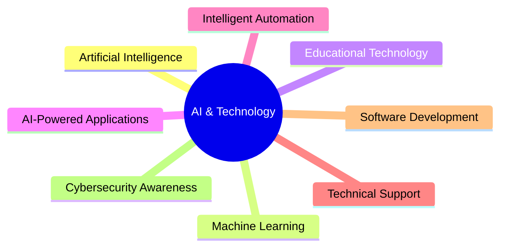

# Hi, I'm Ncamsile Ntuli

<div align="center">


</div>

---

<div align="center">


</div>

---

# About Me


```yaml
Name: Ncamsile Ntuli
Location: Durban, KwaZulu-Natal, South Africa
Education: Diploma in Information Technology
Current Role: IT Support Intern at CAPACITI hosted by CX Experts
Focus Areas:
  - Artificial Intelligence
  - Software Development
  - Educational Technology
  - Intelligent Systems
  - Technical Support
  - AI-Powered Applications

Mission:
  Building intelligent technology that creates
  real opportunities for people across Africa.
```

---

# Tech Arsenal

<div align="center">

## 👨‍💻 Programming & Development


---

## 🤖 AI • Data • Cloud • Databases


</div>

<br>

<p align="center">


</p>

---

# 🌍 Featured AI Projects

<div align="center">

<table>
<tr>
<td width="50%">

## 🎓 Dynacademy

### AI-Powered Education & Career Guidance Platform

Helps South African learners transition into:

* Universities
* TVET Colleges
* Bursary Opportunities
* Career Pathways

### Features

* AI Career Guidance
* APS Calculator
* AI Study Assistant
* University Matching
* Educational Analytics
* AI Chatbot Support

**Tech Stack:**
Python • Firebase • Chart.js • AI Tools

**Live Demo:**
https://dynacademy.base44.app/universities

</td>

<td width="50%">

## 📚 StudyPal

### Generative AI Learning Platform

AI-powered educational platform that generates:

* Quizzes
* Flashcards
* Lesson Plans
* Study Guides

**Tech Stack:**
OpenAI API • Prompt Engineering • Responsive UI

**Live Demo:**
https://study-pal--ncaandlela09.replit.app/

</td>
</tr>

<tr>
<td width="50%">

## 🤖 DynaTech AI Chatbot

Educational conversational AI chatbot focused on:

* AI Literacy
* Interactive Learning
* Guided Quizzes
* Conversational Education

**Tech Stack:**
Botpress Cloud • Conversational AI

</td>

<td width="50%">

## 🔐 Digital Employee Verification System

Biometric employee verification system designed to combat payroll fraud and ghost employees.

🛠️ **Tech Stack:**
Flutter • ASP.NET MVC • Firebase • SQL

</td>
</tr>
</table>

</div>

---

# Current Focus

<div align="center">



</div>

---

# 📈 GitHub Analytics

<div align="center">


</div>

---

# 🏆 Achievements & Certifications

 AI Bootcamp - Coursera & CAPACITI
 SANCS 2026 Alumni
 IBM Python for Data Science, AI & Development
 Cisco Certifications
 Introduction to Modern AI

---

#  Vision Statement

<div align="center">

> ### “I want to build intelligent technology that creates real opportunities for people using AI to improve education, accessibility, and innovation across Africa and beyond.”

</div>

---

# 🌐 Connect With Me

<div align="center">

[](https://www.linkedin.com/in/ncamsile-n-748901276)

[](https://github.com/Ncamie/Ncamie)

[](mailto:ntulincamsile08@gmail.com)

</div>

---

<div align="center">


###  “Innovation becomes meaningful when technology starts changing lives.”

</div>

