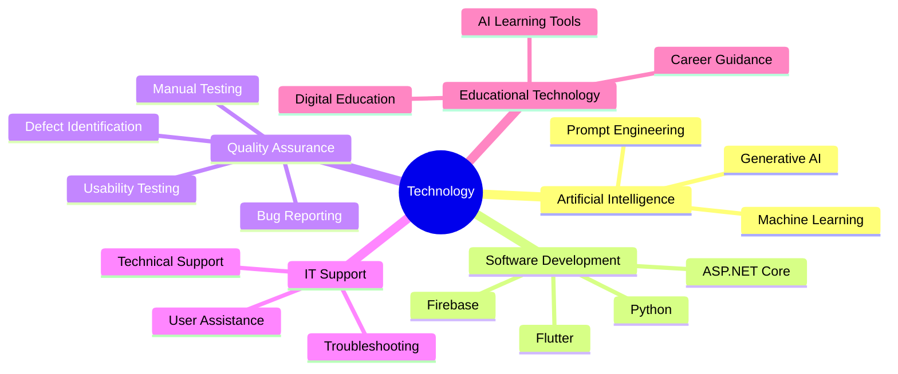

# Hi, I'm Ncamsile Ntuli 

<div align="center">


</div>

<p align="center">
  <b>Software Development • Artificial Intelligence • QA & Testing • IT Support • Educational Technology</b>
</p>

---

<div align="center">


</div>

---

# About Me


```yaml
Name: Ncamsile Ntuli
Location: Durban, KwaZulu-Natal, South Africa
Education: Diploma in Information Technology
Specialisation: Software Development

Current Role:
  IT Support Intern at CAPACITI

Interests:
  - Artificial Intelligence
  - Software Development
  - Quality Assurance & Software Testing
  - Educational Technology
  - IT Support
  - Intelligent Systems
  - Digital Solutions

Currently Learning:
  - Artificial Intelligence
  - Machine Learning
  - Software Testing
  - Technical Support
  - AI-Powered Application Development

Goal:
  Build practical technology solutions that solve real-world
  problems and create opportunities through innovation.
```

I am an **IT graduate specialising in Software Development** with a growing interest in **Artificial Intelligence, Quality Assurance, Software Testing and technical support**.

I enjoy exploring how technology works, identifying problems, improving applications and building solutions that are practical and user-focused.

My experience includes working with **Flutter, Firebase, ASP.NET Core, C#, Python, SQL and AI-powered platforms**, while my current IT support experience continues to strengthen my troubleshooting, communication and problem-solving skills.

---

# Tech Stack

## Programming & Development

<p>

</p>

* Python
* C#
* Flutter / Dart
* ASP.NET Core MVC
* HTML & CSS
* Node.js

---

## AI & Data

<p>

</p>

* Artificial Intelligence
* Prompt Engineering
* Generative AI
* Machine Learning Fundamentals
* AI-powered applications
* Data analysis fundamentals
* Power BI

---

## Cloud, Databases & Tools

<p>

</p>

* Firebase Authentication
* Firestore
* Firebase Realtime Database
* MySQL
* SQLite
* Git & GitHub
* Visual Studio
* Visual Studio Code
* Figma

---

## Quality Assurance & IT Support

<p align="center">


</p>

My QA and technical interests include:

* Manual software testing
* Functional testing
* Identifying defects and inconsistencies
* Usability testing
* Bug reporting
* Troubleshooting
* Technical support
* Basic test documentation
* Understanding user requirements

---

# Featured Projects

<div align="center">

<table>
<tr>

<td width="50%">

## Dynacademy

### AI-Powered Education & Career Guidance Platform

A platform designed to help South African learners explore education and career opportunities.

### Features

* AI Career Guidance
* APS Calculator
* AI Study Assistant
* University Matching
* Educational Analytics
* AI Chatbot Support

**Tech Stack:**
Python • Firebase • Chart.js • AI Tools

**Live Demo:**
https://dynacademy.base44.app/universities

</td>

<td width="50%">

## StudyPal

### Generative AI Learning Platform

An AI-powered learning platform designed to assist students with studying and educational content creation.

### Features

* AI-generated quizzes
* Flashcards
* Lesson plans
* Study guides
* Interactive learning

**Tech Stack:**
OpenAI API • Prompt Engineering • Responsive UI

**Live Demo:**
https://study-pal--ncaandlela09.replit.app/

</td>

</tr>

<tr>

<td width="50%">

## DynaTech AI Chatbot

### Conversational Educational AI

An educational chatbot focused on improving AI literacy and interactive learning.

### Features

* AI literacy
* Interactive learning
* Guided quizzes
* Conversational education

**Tech Stack:**
Botpress Cloud • Conversational AI

</td>

<td width="50%">

## DEVS Project

### Integrated Mobile & Web Application

A practical development project involving a mobile application and web application with cloud-based services.

**Tech Stack:**
Flutter • ASP.NET Core MVC • Firebase

### Focus

* Mobile development
* Web development
* Firebase integration
* Authentication
* Application functionality
* Troubleshooting and debugging

</td>

</tr>

<tr>

<td width="50%">

## Digital Employee Verification System

### Biometric Employee Verification

A digital employee verification concept designed to improve employee authentication and help address payroll fraud and ghost employees.

**Tech Stack:**
Flutter • ASP.NET MVC • Firebase • SQL

### Focus

* Biometric authentication
* Employee verification
* Database integration
* Mobile application development

</td>

<td width="50%">

## Consultation Booking Application

### Mobile Booking System

A Flutter-based application designed to manage consultation bookings.

**Tech Stack:**
Flutter • Dart • Provider • Firebase

### Focus

* Booking management
* State management
* Firebase integration
* Authentication
* Firestore
* MVVM architecture

</td>

</tr>
</table>

</div>

---

#  QA & Testing Journey

<div align="center">


</div>

I have a strong interest in **Quality Assurance and software testing**, particularly in understanding how applications behave from a user's perspective.

I enjoy:

* Exploring applications
* Finding defects and inconsistencies
* Testing functionality
* Evaluating usability
* Identifying edge cases
* Documenting issues
* Suggesting improvements
* Understanding how systems can be made more reliable

I am also continuously developing my knowledge of software testing methodologies and QA practices.

---

# Current Focus


```mermaid
mindmap
  root((Technology))
    Artificial Intelligence
      Generative AI
      Prompt Engineering
      Machine Learning
    Software Development
      Flutter
      ASP.NET Core
      Firebase
      Python
    Quality Assurance
      Manual Testing
      Bug Reporting
      Usability Testing
      Defect Identification
    IT Support
      Troubleshooting
      Technical Support
      User Assistance
    Educational Technology
      AI Learning Tools
      Career Guidance
      Digital Education
```

---

# GitHub Analytics

<div align="center">


</div>

<br>

<div align="center">


</div>

---

# Achievements & Certifications

* Diploma in Information Technology – Central University of Technology
* CAPACITI IT / Technology Programme
* Code4Impact QA Cohort 2026
* AI Bootcamp – Coursera & CAPACITI
* SANCS 2026 Alumni
* IBM Python for Data Science, AI & Development
* Cisco Certifications
* Introduction to Modern AI

---

# My Vision

<div align="center">

> ### "I want to build intelligent technology that creates real opportunities for people by improving education, accessibility and innovation across Africa and beyond."

</div>

---

# Let's Connect

<div align="center">

<a href="https://www.linkedin.com/in/ncamsile-n-748901276">

</a>

<a href="https://github.com/Ncamie">

</a>

<a href="mailto:ntulincamsile08@gmail.com">

</a>

</div>

---

<div align="center">


### "Innovation becomes meaningful when technology starts changing lives."

</div>


